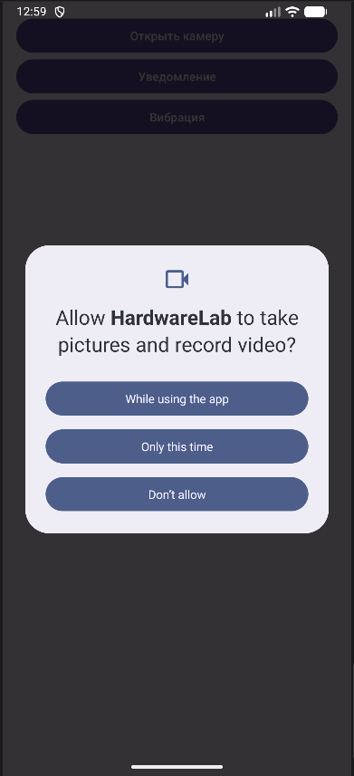
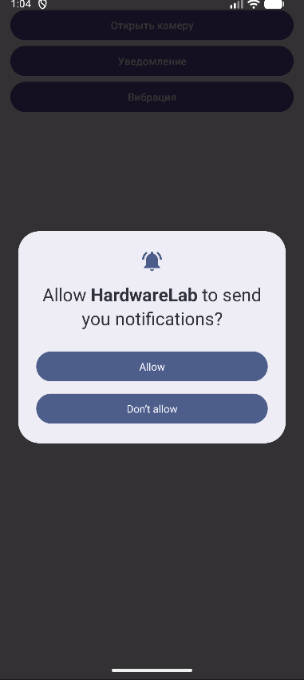
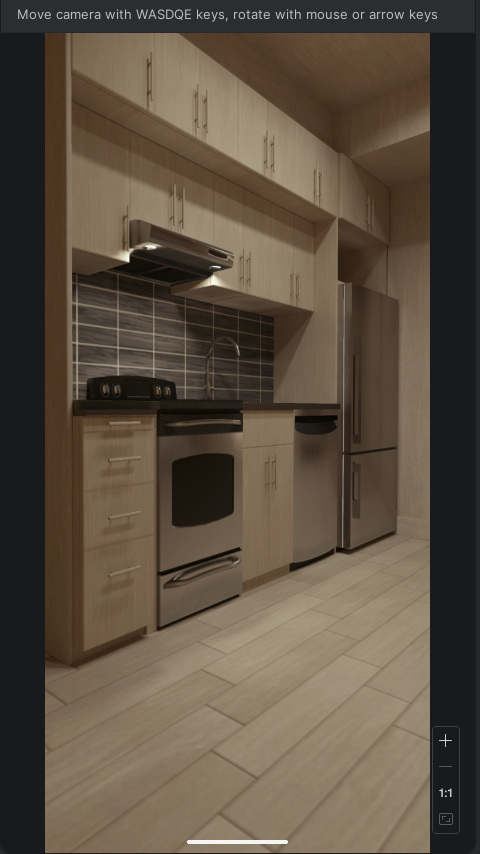

# Практическая работа № 10. Использование аппаратных возможностей устройства. Разрешения, уведомления, вибрация, камера
#### Изучить механизм работы с разрешениями в Android, научиться создавать уведомления (Notification), управлять вибрацией устройства, а также получать доступ к камере для предварительного просмотра изображения.

Выполнил ИНС-б-о-24-1, Пузанов Александр Александрович

### Ход выполнения практической работы:
Вариант 2. Планировщик заданий с вибрацией. То же, что и вариант 1, но вместо уведомления (или вместе с ним) устройство вибрирует по определённому паттерну.
#### 1. Подготовка манифеста
```xml
    <uses-permission android:name="android.permission.VIBRATE" />
    <uses-permission android:name="android.permission.POST_NOTIFICATIONS" />
    <uses-permission android:name="android.permission.CAMERA" />
    <uses-permission
        android:name="android.permission.WRITE_EXTERNAL_STORAGE"
        android:maxSdkVersion="28" />
```
#### 2. Запрос разрешений во время выполнения
MainActivity.java:
```java
public class MainActivity extends AppCompatActivity {

    private static final int REQUEST_CODE_CAMERA = 100;

    @Override
    protected void onCreate(Bundle savedInstanceState) {
        super.onCreate(savedInstanceState);
        setContentView(R.layout.activity_main);

        Button btnCamera = findViewById(R.id.btnCamera);
        btnCamera.setOnClickListener(v -> checkCameraPermission());
    }

    private void checkCameraPermission() {

        if (ContextCompat.checkSelfPermission(this, Manifest.permission.CAMERA)
                == PackageManager.PERMISSION_GRANTED) {
            openCameraActivity();
        } else {

            if (ActivityCompat.shouldShowRequestPermissionRationale(this,
                    Manifest.permission.CAMERA)) {
                Toast.makeText(this,
                        "Разрешение нужно для камеры",
                        Toast.LENGTH_SHORT).show();
            }

            ActivityCompat.requestPermissions(this,
                    new String[]{Manifest.permission.CAMERA},
                    REQUEST_CODE_CAMERA);
        }
    }

    private void openCameraActivity() {
        startActivity(new Intent(this, CameraActivity.class));
    }

    @Override
    public void onRequestPermissionsResult(int requestCode,
                                           @NonNull String[] permissions,
                                           @NonNull int[] grantResults) {
        super.onRequestPermissionsResult(requestCode, permissions, grantResults);

        if (requestCode == REQUEST_CODE_CAMERA) {
            if (grantResults.length > 0 &&
                    grantResults[0] == PackageManager.PERMISSION_GRANTED) {
                openCameraActivity();
            } else {
                Toast.makeText(this,
                        "Нет доступа к камере",
                        Toast.LENGTH_LONG).show();
            }
        }
    }
}
```
Результат:


#### 3. Создание уведомления
MainActivity.java:
```java
public class MainActivity extends AppCompatActivity {

    private static final int REQUEST_CODE_CAMERA = 100;
    private static final String CHANNEL_ID = "CHANNEL_ID";
    private static final int NOTIF_ID = 1;
    private static final int REQUEST_CODE_NOTIF = 200;

    @Override
    protected void onCreate(Bundle savedInstanceState) {
        super.onCreate(savedInstanceState);
        setContentView(R.layout.activity_main);

        Button btnCamera = findViewById(R.id.btnCamera);
        Button btnNotify = findViewById(R.id.btnNotify);

        btnCamera.setOnClickListener(v -> checkCameraPermission());
        btnNotify.setOnClickListener(v -> checkNotificationPermissionAndSend());
    }

    private void checkCameraPermission() {

        if (ContextCompat.checkSelfPermission(this, Manifest.permission.CAMERA)
                == PackageManager.PERMISSION_GRANTED) {
            openCameraActivity();
        } else {

            if (ActivityCompat.shouldShowRequestPermissionRationale(this,
                    Manifest.permission.CAMERA)) {
                Toast.makeText(this,
                        "Разрешение нужно для камеры",
                        Toast.LENGTH_SHORT).show();
            }

            ActivityCompat.requestPermissions(this,
                    new String[]{Manifest.permission.CAMERA},
                    REQUEST_CODE_CAMERA);
        }
    }

    private void openCameraActivity() {
        startActivity(new Intent(this, CameraActivity.class));
    }

    @Override
    public void onRequestPermissionsResult(int requestCode,
                                           @NonNull String[] permissions,
                                           @NonNull int[] grantResults) {
        super.onRequestPermissionsResult(requestCode, permissions, grantResults);

        if (requestCode == REQUEST_CODE_NOTIF) {
            if (grantResults.length > 0 &&
                    grantResults[0] == PackageManager.PERMISSION_GRANTED) {
                sendNotification();
            } else {
                Toast.makeText(this,
                        "Нет разрешения на уведомления",
                        Toast.LENGTH_SHORT).show();
            }
        }
    }

    private void createNotificationChannel() {
        if (Build.VERSION.SDK_INT >= Build.VERSION_CODES.O) {
            NotificationChannel channel = new NotificationChannel(
                    CHANNEL_ID,
                    "Reminders",
                    NotificationManager.IMPORTANCE_DEFAULT
            );

            NotificationManager manager = getSystemService(NotificationManager.class);
            if (manager != null) {
                manager.createNotificationChannel(channel);
            }
        }
    }

    private void sendNotification() {
        createNotificationChannel();

        NotificationCompat.Builder builder =
                new NotificationCompat.Builder(this, CHANNEL_ID)
                        .setSmallIcon(android.R.drawable.ic_dialog_info)
                        .setContentTitle("Напоминание")
                        .setContentText("Пришло время выполнить задачу")
                        .setAutoCancel(true)
                        .setPriority(NotificationCompat.PRIORITY_DEFAULT);

        NotificationManagerCompat.from(this).notify(NOTIF_ID, builder.build());
    }

    private void checkNotificationPermissionAndSend() {

        if (Build.VERSION.SDK_INT >= Build.VERSION_CODES.TIRAMISU) {

            if (ContextCompat.checkSelfPermission(this,
                    Manifest.permission.POST_NOTIFICATIONS)
                    == PackageManager.PERMISSION_GRANTED) {

                sendNotification();

            } else {

                ActivityCompat.requestPermissions(this,
                        new String[]{Manifest.permission.POST_NOTIFICATIONS},
                        REQUEST_CODE_NOTIF);
            }

        } else {
            sendNotification();
        }
    }
}
```
Результат (за разрешением последовал звук):


#### 4. Управление вибрацией
MainActivity.java:
```java

```
#### 5. Предварительный просмотр камеры
activity_camera.xml:
```xml
<?xml version="1.0" encoding="utf-8"?>
<FrameLayout xmlns:android="http://schemas.android.com/apk/res/android"
    android:layout_width="match_parent"
    android:layout_height="match_parent">

    <SurfaceView
        android:id="@+id/surfaceView"
        android:layout_width="match_parent"
        android:layout_height="match_parent"/>

</FrameLayout>
```
CameraActivity.java:
```java
public class CameraActivity extends AppCompatActivity implements SurfaceHolder.Callback {

    private Camera camera;
    private SurfaceHolder holder;

    @Override
    protected void onCreate(Bundle savedInstanceState) {
        super.onCreate(savedInstanceState);
        setContentView(R.layout.activity_camera);

        SurfaceView surfaceView = findViewById(R.id.surfaceView);
        holder = surfaceView.getHolder();
        holder.addCallback(this);
    }

    @Override
    public void surfaceCreated(@NonNull SurfaceHolder holder) {
        try {
            camera = Camera.open();
            camera.setPreviewDisplay(holder);
            camera.setDisplayOrientation(90);
            camera.startPreview();
        } catch (Exception e) {
            e.printStackTrace();
        }
    }

    @Override
    public void surfaceChanged(@NonNull SurfaceHolder holder, int format, int width, int height) {
        if (camera != null) {
            camera.stopPreview();
            camera.startPreview();
        }
    }

    @Override
    public void surfaceDestroyed(@NonNull SurfaceHolder holder) {
        if (camera != null) {
            camera.stopPreview();
            camera.release();
            camera = null;
        }
    }
}
```
Результат:


### Контрольные вопросы:
1. Нормальные и опасные разрешения
- Normal permissions - автоматически выдаются системой, не требуют запроса у пользователя. 
Примеры: INTERNET, ACCESS_NETWORK_STATE.

- Dangerous permissions - требуют согласия пользователя во время работы приложения.
Примеры: CAMERA, READ_CONTACTS, ACCESS_FINE_LOCATION, RECORD_AUDIO.
2. Как запросить опасное разрешение

Последовательность:
- Проверить разрешение (checkSelfPermission)
- Если нет - показать объяснение (опционально)
- Вызвать requestPermissions()
- Обработать результат в onRequestPermissionsResult()
3. NotificationChannel
Нужен в для:
- группировки уведомлений
- управления важностью (звук, вибрация)
- обязательного создания канала перед отправкой уведомлений
4. Создание уведомления

Шаги:
- Создать канал (если Android 8+)
- Создать NotificationCompat.Builder
- Вызвать NotificationManager.notify()
5. Vibrator и вибрация

Основные методы:
- vibrate(long duration)
- vibrate(long[] pattern)
- vibrate(VibrationEffect effect)

Пример паттерна: {0, 500, 200, 500} (ждать → вибрация → пауза → вибрация)
6. Доступ к камере (preview)

Используются:
- Camera (старый API)
- CameraX (современный вариант)
- Camera2 API

Для простого preview:

- SurfaceView
- Camera.setPreviewDisplay()

7. Что будет без runtime permission (Android 6.0+)
- приложение упадёт с SecurityException
- или функционал просто не выполнится
- доступ будет запрещён системой
8. Как проверить разрешение
```java
ContextCompat.checkSelfPermission(
        this,
        Manifest.permission.CAMERA
) == PackageManager.PERMISSION_GRANTED
```

Если true → есть доступ

Если false → нужно запрашивать