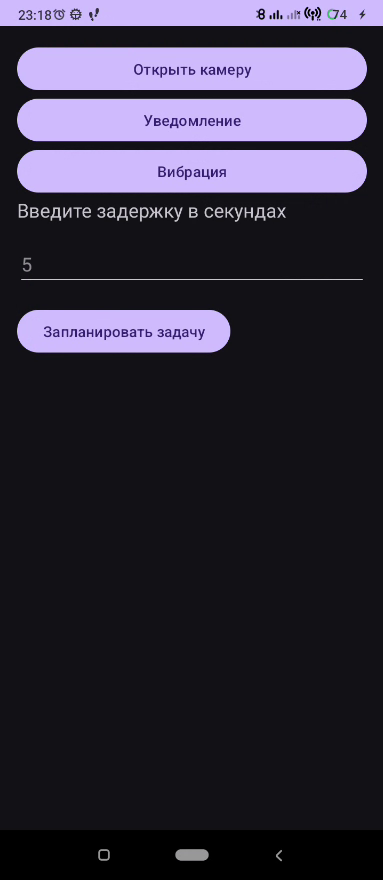
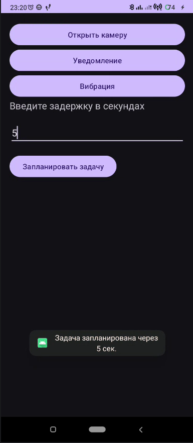

# Практическая работа № 10. Использование аппаратных возможностей устройства. Разрешения, уведомления, вибрация, камера
#### Изучить механизм работы с разрешениями в Android, научиться создавать уведомления (Notification), управлять вибрацией устройства, а также получать доступ к камере для предварительного просмотра изображения.

Выполнил ИНС-б-о-24-1, Пузанов Александр Александрович

### Ход выполнения практической работы:
Вариант 2. Планировщик заданий с вибрацией. То же, что и вариант 1, но вместо уведомления (или вместе с ним) устройство вибрирует по определённому паттерну.
#### 1. Запрос разрешений во время выполнения

#### 2. Создание уведомления
За разрешением последовал звук


#### 3. Предварительный просмотр камеры

#### 3. Вибрация
Тоже работает

### Индивидуальное задание (Вариант 2. Планировщик заданий с вибрацией):
MainActivity.java
```java
// ...
private static final int REQUEST_CODE_NOTIFICATIONS = 100;
private EditText etSeconds;

protected void onCreate(Bundle savedInstanceState) {
    // ...

    etSeconds = findViewById(R.id.etSeconds);
    Button btnStart = findViewById(R.id.btnStart);

    btnStart.setOnClickListener(v -> scheduleTask());
}

//...

private void scheduleTask() {
    String text = etSeconds.getText().toString();

    if (text.isEmpty()) {
        Toast.makeText(this, "Введите количество секунд", Toast.LENGTH_SHORT).show();
        return;
    }

    int seconds = Integer.parseInt(text);

    Intent intent = new Intent(this, AlarmReceiver.class);

    PendingIntent pendingIntent = PendingIntent.getBroadcast(
            this,
            0,
            intent,
            PendingIntent.FLAG_UPDATE_CURRENT | PendingIntent.FLAG_IMMUTABLE
    );

    AlarmManager alarmManager =
            (AlarmManager) getSystemService(ALARM_SERVICE);

    long triggerTime = System.currentTimeMillis() + seconds * 1000L;

    if (alarmManager != null) {
        alarmManager.set(
                AlarmManager.RTC_WAKEUP,
                triggerTime,
                pendingIntent
        );
    }

    Toast.makeText(this,
            "Задача запланирована через " + seconds + " сек.",
            Toast.LENGTH_LONG).show();
}
```
AlarmReceiver.java
```java
public class AlarmReceiver extends BroadcastReceiver {

    private static final String CHANNEL_ID = "TASK_CHANNEL";

    @Override
    public void onReceive(Context context, Intent intent) {
        vibrate(context);
        sendNotification(context);
    }

    private void vibrate(Context context) {
        Vibrator vibrator =
                (Vibrator) context.getSystemService(Context.VIBRATOR_SERVICE);

        if (vibrator != null && vibrator.hasVibrator()) {
            long[] pattern = {0, 500, 1000, 500};

            if (Build.VERSION.SDK_INT >= Build.VERSION_CODES.O) {
                vibrator.vibrate(
                        VibrationEffect.createWaveform(pattern, -1)
                );
            } else {
                vibrator.vibrate(pattern, -1);
            }
        }
    }

    private void sendNotification(Context context) {
        createNotificationChannel(context);

        Intent intent = new Intent(context, MainActivity.class);

        PendingIntent pendingIntent = PendingIntent.getActivity(
                context,
                0,
                intent,
                PendingIntent.FLAG_UPDATE_CURRENT | PendingIntent.FLAG_IMMUTABLE
        );

        NotificationCompat.Builder builder =
                new NotificationCompat.Builder(context, CHANNEL_ID)
                        .setSmallIcon(android.R.drawable.ic_dialog_info)
                        .setContentTitle("Напоминание")
                        .setContentText("Пора выполнить задачу")
                        .setPriority(NotificationCompat.PRIORITY_DEFAULT)
                        .setAutoCancel(true)
                        .setContentIntent(pendingIntent);

        NotificationManagerCompat notificationManager =
                NotificationManagerCompat.from(context);

        notificationManager.notify(1, builder.build());
    }

    private void createNotificationChannel(Context context) {
        if (Build.VERSION.SDK_INT >= Build.VERSION_CODES.O) {
            NotificationChannel channel =
                    new NotificationChannel(
                            CHANNEL_ID,
                            "Task Channel",
                            NotificationManager.IMPORTANCE_DEFAULT
                    );

            NotificationManager manager =
                    context.getSystemService(NotificationManager.class);

            if (manager != null) {
                manager.createNotificationChannel(channel);
            }
        }
    }
}
```

Интерфейс:



Уведомление:



Через 5 секунд вибрация
### Контрольные вопросы:
1. Нормальные и опасные разрешения
- Normal permissions - автоматически выдаются системой, не требуют запроса у пользователя. 
Примеры: INTERNET, ACCESS_NETWORK_STATE.

- Dangerous permissions - требуют согласия пользователя во время работы приложения.
Примеры: CAMERA, READ_CONTACTS, ACCESS_FINE_LOCATION, RECORD_AUDIO.
2. Как запросить опасное разрешение

Последовательность:
- Проверить разрешение (checkSelfPermission)
- Если нет - показать объяснение (опционально)
- Вызвать requestPermissions()
- Обработать результат в onRequestPermissionsResult()
3. NotificationChannel
Нужен в для:
- группировки уведомлений
- управления важностью (звук, вибрация)
- обязательного создания канала перед отправкой уведомлений
4. Создание уведомления

Шаги:
- Создать канал (если Android 8+)
- Создать NotificationCompat.Builder
- Вызвать NotificationManager.notify()
5. Vibrator и вибрация

Основные методы:
- vibrate(long duration)
- vibrate(long[] pattern)
- vibrate(VibrationEffect effect)

Пример паттерна: {0, 500, 200, 500} (ждать → вибрация → пауза → вибрация)
6. Доступ к камере (preview)

Используются:
- Camera (старый API)
- CameraX (современный вариант)
- Camera2 API

Для простого preview:

- SurfaceView
- Camera.setPreviewDisplay()

7. Что будет без runtime permission (Android 6.0+)
- приложение упадёт с SecurityException
- или функционал просто не выполнится
- доступ будет запрещён системой
8. Как проверить разрешение
```java
ContextCompat.checkSelfPermission(
        this,
        Manifest.permission.CAMERA
) == PackageManager.PERMISSION_GRANTED
```

Если true → есть доступ

Если false → нужно запрашивать
